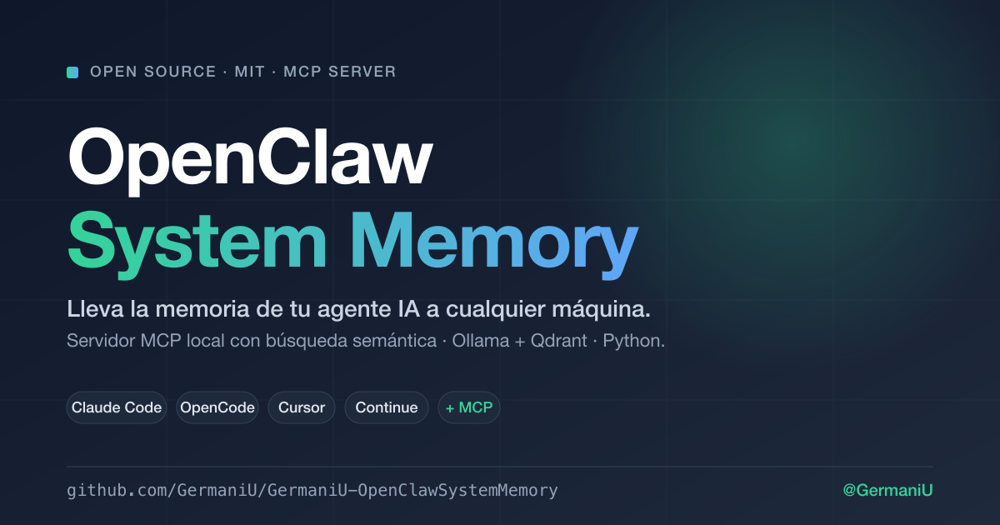

<p align="center">
  
</p>

# OpenClaw System Memory — Memoria local para agentes IA vía MCP

> **Lleva la memoria de tu agente IA a cualquier máquina.**
> Servidor MCP open source que da memoria persistente con búsqueda semántica a Claude Code, OpenCode, Cursor, Continue y cualquier cliente compatible con [Model Context Protocol](https://modelcontextprotocol.io). Embeddings con Ollama, vector search con Qdrant, **100% en tu hardware**.

[](LICENSE)
[](https://modelcontextprotocol.io)
[](server/pyproject.toml)
[](server/tests/unit)
[](docker-compose.yml)
[](CONTRIBUTING.md)

**Tags:** `mcp-server` · `ai-agents` · `ollama` · `qdrant` · `claude-code` · `cursor` · `opencode` · `semantic-search` · `embeddings` · `agent-memory` · `vector-database` · `rag` · `local-first` · `self-hosted`

---

## 💡 Por qué existe

Los agentes IA olvidan todo entre conversaciones. Las soluciones existentes son cloud-only, multi-tenant pesado, o están atadas a un único cliente. **OpenClaw System Memory** resuelve esto con tres ideas simples:

1. **Tu memoria, tu máquina.** Embeddings + vectores corren localmente. Cero datos en la nube.
2. **Conectas una vez, funciona en todos lados.** Es un servidor MCP estándar — cualquier cliente que hable MCP lo usa sin custom code.
3. **Cero overhead.** `docker compose up` y tienes 7 tools listas para tu agente.

---

## ⚡ Quickstart (3 comandos)

> **Pre-requisito:** un Ollama con un modelo de embeddings descargado. Lee la advertencia abajo antes de continuar.

```bash
git clone https://github.com/GermaniU/GermaniU-OpenClawSystemMemory.git
cd GermaniU-OpenClawSystemMemory
cp .env.example .env && docker compose up -d
```

Endpoint MCP: `http://localhost:8765/mcp`. Pégalo en la config de tu cliente (ver [`docs/CLIENTS.md`](docs/CLIENTS.md) — Claude Code, OpenCode, Cursor, Continue).

---

## ⚠️ Antes de empezar — Ollama y embeddings

Esto te ahorra una tarde de debugging:

> **Ollama Cloud (`https://ollama.com`) hoy NO ofrece modelos de embedding.** Su catálogo cloud es solo de LLMs de chat (kimi-k2, deepseek, gpt-oss, qwen-coder, glm…). `POST https://ollama.com/api/embed` devuelve **401** aunque tu API key sea válida para `/api/chat`.

**Necesitas embeddings → necesitas Ollama en el dispositivo (local o tu servidor).**

```bash
# Instala Ollama: https://ollama.com/download
ollama pull bge-m3              # 1.2GB · 1024 dim · multilingüe (recomendado para español)
# alternativas:
ollama pull mxbai-embed-large   # 670MB · 1024 dim · alta calidad en inglés
ollama pull nomic-embed-text    # 274MB ·  768 dim · ligero, inglés
```

Verifica antes de seguir:

```bash
curl -X POST http://localhost:11434/api/embeddings \
  -H 'Content-Type: application/json' \
  -d '{"model":"bge-m3","prompt":"hola"}' | head -c 200
# → {"embedding":[-0.13...,0.72...]}  ← debe imprimir un array de floats
```

| Setup                                    | `OLLAMA_URL`                              | Funciona |
|------------------------------------------|-------------------------------------------|----------|
| **Ollama local** ✅ recomendado          | `http://host.docker.internal:11434`       | sí       |
| **Ollama remoto** (tu servidor / VPS)    | `https://ollama.tu-dominio.com`           | sí       |
| **Ollama Cloud** ❌ no da embeddings     | `https://ollama.com`                      | no       |

---

## 🛠 Tools MCP expuestas

| Tool             | Para qué |
|------------------|----------|
| `memory_save`    | Guardar texto + tags + metadata. Embebe automáticamente. |
| `memory_search`  | Búsqueda semántica con filtro por namespace y `min_score`. |
| `memory_update`  | Cambiar contenido/tags/metadata por id. Re-embebe si cambia el contenido. |
| `memory_delete`  | Borrar por id. |
| `memory_list`    | Paginado por namespace. |
| `memory_recent`  | Las últimas N por `updated_at`. |
| `memory_stats`   | Conteo, namespaces, oldest/newest. |

Schemas + ejemplos de invocación en [`docs/CLIENTS.md`](docs/CLIENTS.md).

---

## 🎯 Alcance actual

OpenClaw System Memory es deliberadamente pequeño. Hace **una cosa bien: memoria semántica de texto plano**. No es un sistema de RAG completo, no es un knowledge base, no es un grafo.

### Lo que SÍ hace
- ✅ Almacena y recupera **texto puro** con embeddings.
- ✅ Búsqueda semántica con filtro por `namespace` y `min_score`.
- ✅ Tags + metadata libres en cada entrada.
- ✅ 7 tools MCP estándar para cualquier agente compatible.
- ✅ Persistencia en disco (volumen Qdrant), backup = `tar`.

### Lo que NO hace (todavía)
- ❌ **No soporta imágenes ni gráficas.** Solo texto.
- ❌ **No soporta PDFs ni archivos binarios** — extrae el texto antes de guardarlo.
- ❌ **No es multi-tenant.** Una persona, una máquina, una memoria (con namespaces para separar contextos).
- ❌ **No tiene UI propia.** Lo administras desde el agente o por curl/MCP.
- ❌ **No sincroniza entre máquinas.** Backup manual (`tar` del volumen) si quieres mover datos.
- ❌ **No tiene auth.** Solo escucha en `localhost`. Si lo expones a internet, pon un proxy con auth.

Si necesitas algo de la lista NO, abre un [issue](https://github.com/GermaniU/GermaniU-OpenClawSystemMemory/issues) con caso de uso real (no especulativo) — vamos por demanda, no por especulación.

---

## 🔌 Conectar tu cliente

Configuración lista para copiar en [`docs/CLIENTS.md`](docs/CLIENTS.md):

- 🟦 **Claude Code** — añade a `~/.claude/.mcp.json` y habilita en `settings.json`.
- 🟧 **Cursor** — Settings → MCP Servers → Add new MCP Server.
- 🟩 **Continue** (VS Code / JetBrains) — `~/.continue/config.json`.
- 🟪 **OpenCode** — `~/.config/opencode/config.json`.

Snippets JSON listos en [`examples/`](examples/).

---

## 🧪 Smoke test con curl

Para validar el stack sin necesidad de un cliente MCP:

```bash
SESSION=$(curl -sS -D - -o /dev/null -X POST http://localhost:8765/mcp \
  -H 'Content-Type: application/json' \
  -H 'Accept: application/json, text/event-stream' \
  -H 'MCP-Protocol-Version: 2025-06-18' \
  -d '{"jsonrpc":"2.0","id":1,"method":"initialize","params":{"protocolVersion":"2025-06-18","capabilities":{},"clientInfo":{"name":"smoke","version":"0.1"}}}' \
  | tr -d '\r' | awk '/^mcp-session-id:/{print $2}')

curl -sS -X POST http://localhost:8765/mcp \
  -H 'Content-Type: application/json' \
  -H 'Accept: application/json, text/event-stream' \
  -H 'MCP-Protocol-Version: 2025-06-18' \
  -H "mcp-session-id: $SESSION" \
  -d '{"jsonrpc":"2.0","method":"notifications/initialized"}'

curl -sS -X POST http://localhost:8765/mcp \
  -H 'Content-Type: application/json' \
  -H 'Accept: application/json, text/event-stream' \
  -H 'MCP-Protocol-Version: 2025-06-18' \
  -H "mcp-session-id: $SESSION" \
  -d '{"jsonrpc":"2.0","id":2,"method":"tools/call","params":{"name":"memory_save","arguments":{"inp":{"content":"funciona end-to-end","namespace":"smoke","tags":["ok"]}}}}'
```

---

## 🧱 Arquitectura (vertical slice)

```
┌─ tu agente (Claude Code / OpenCode / Cursor / …) ─┐
│           │ MCP streamable HTTP                    │
│           ▼                                        │
│    localhost:8765/mcp                              │
└────────────┬───────────────────────────────────────┘
             │
   ┌─────────▼────────┐         ┌─────────────────┐
   │   mcp-memory     │────────▶│  Ollama (local  │
   │   (Python+MCP)   │         │  o remoto)      │
   └─────────┬────────┘         └─────────────────┘
             │
             ▼
   ┌──────────────────┐
   │      Qdrant      │  ← docker compose o standalone
   └──────────────────┘
```

Cada tool MCP vive en su propia carpeta (`server/src/openclaw_memory/tools/<tool>/handler.py`). Añadir una tool nueva = añadir una carpeta + un decorator en `server.py`. Cero acoplamiento.

Detalle técnico en [`docs/ARCHITECTURE.md`](docs/ARCHITECTURE.md).

---

## 🤝 Contribuye

OpenClaw System Memory es **un regalo a la comunidad** — MIT, sin trampas. PRs, issues y forks bienvenidos.

**Reglas (resumen):**
1. **Clean Code · SOLID · KISS · YAGNI · Vertical slice · Tests primero.** No se aceptan PRs sin tests para la lógica nueva.
2. **Identifiers en inglés**, comentarios y commits en español. Conventional Commits (`feat:`, `fix:`, `docs:`, `refactor:`, `test:`, `chore:`).
3. **Una tool nueva = una carpeta nueva.** No tocar slices existentes salvo bug.
4. **DIP**: dependencias externas detrás de un `Protocol` para que el test no necesite Docker.
5. **Sin abstracciones especulativas.** Si solo hay 1 implementación, no hay interfaz.
6. **Documenta el WHY, no el WHAT.** El nombre de la función ya cuenta el qué.

Detalle completo + workflow paso a paso en [`CONTRIBUTING.md`](CONTRIBUTING.md).

```bash
# Setup local de desarrollo (sin Docker)
cd server
python -m venv .venv && source .venv/bin/activate
pip install -e ".[dev]"
pytest -q                     # 16 unit tests, <0.3s, sin Docker ni Ollama
ruff check src tests
```

---

## 🩹 Troubleshooting (errores reales que ya pisé)

**`401 unauthorized` desde el MCP server al hacer `memory_save`**
- Apuntas a Ollama Cloud y tu cuenta no tiene embeddings (es lo normal hoy). Cambia `OLLAMA_URL` a Ollama local/remoto.

**`404 Not Found` para `https://ollama.com/api/embeddings`**
- Mismo problema: Ollama Cloud no expone ese endpoint.

**`Connection reset by peer` al hacer `curl http://localhost:8765/mcp`**
- Falta el header `Accept: application/json, text/event-stream`. Sin él, FastMCP cierra la conexión.

**`memory_search` devuelve vacío**
- ¿Mismo namespace? Si guardaste sin namespace, busca con `default`. Baja `min_score` a `0.0` para diagnosticar.

**`mcp-memory` reinicia en bucle**
- `docker compose logs mcp-memory`. Causas: modelo no descargado en tu Ollama, `EMBEDDING_DIM` no coincide con el modelo (bge-m3=1024, no 768), o Qdrant aún arrancando.

**Cambiar de modelo de embedding después de tener datos**
- Los vectores viejos no son compatibles con otra dimensión:
  ```bash
  curl -X DELETE http://localhost:6333/collections/openclaw_memory
  docker compose up -d --force-recreate mcp-memory
  ```

---

## 📚 Documentación

- [`docs/INSTALL.md`](docs/INSTALL.md) — instalación detallada, variables, troubleshooting extendido.
- [`docs/CLIENTS.md`](docs/CLIENTS.md) — config para Claude Code, OpenCode, Cursor, Continue.
- [`docs/ARCHITECTURE.md`](docs/ARCHITECTURE.md) — decisiones técnicas y por qué.
- [`CONTRIBUTING.md`](CONTRIBUTING.md) — disciplinas, workflow, cómo añadir una tool.
- [`legacy/`](legacy/) — primera implementación en Node (deprecada, se conserva como referencia).

---

## 📄 Licencia

[MIT](LICENSE) — úsalo, fórkalo, regálale a otra gente más memoria local.

---

**Hecho por [@GermaniU](https://github.com/GermaniU)** con disciplinas de software profesional. Si te ha servido, una ⭐ ayuda a que más gente lo encuentre. Si te ha roto algo, abre un issue y lo arreglamos.
