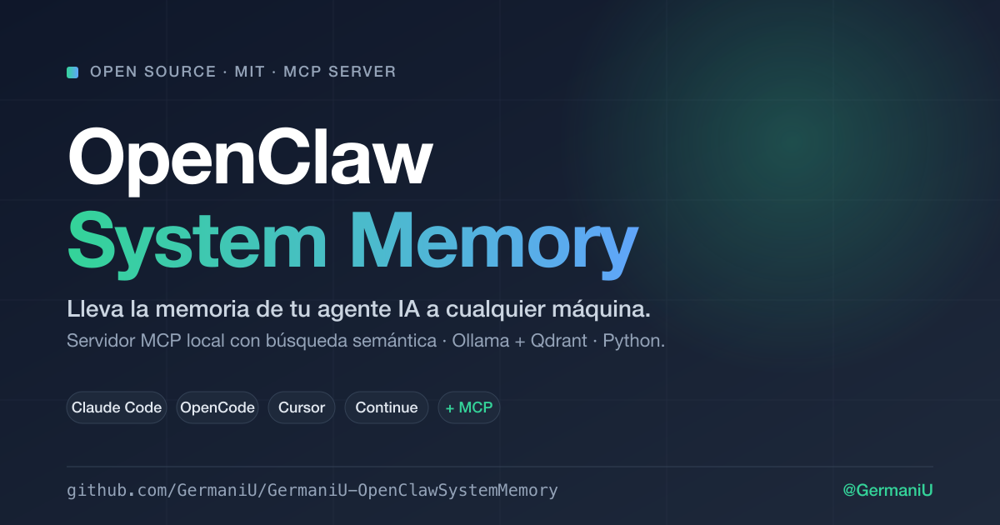

<p align="center">
  
</p>

[English](README.en.md) · **Español**

# MCP Memory — Memoria local para agentes IA vía MCP

> **Lleva la memoria de tu agente IA a cualquier máquina.**
> Servidor MCP open source que da memoria persistente con búsqueda léxica (BM25) a Claude Code, OpenCode, Cursor, Continue y cualquier cliente compatible con [Model Context Protocol](https://modelcontextprotocol.io). SQLite + FTS5, **cero infra externa, 100% en tu hardware**.

[](LICENSE)
[](https://modelcontextprotocol.io)
[](server/pyproject.toml)
[](https://github.com/GermaniU/mcp-memory/actions/workflows/ci.yml)
[](server/src/mcp_memory/shared/store.py)
[](CONTRIBUTING.md)

**Tags:** `mcp-server` · `ai-agents` · `sqlite` · `fts5` · `bm25` · `claude-code` · `cursor` · `opencode` · `lexical-search` · `agent-memory` · `local-first` · `self-hosted`

---

## 💡 Por qué existe

Los agentes IA olvidan todo entre conversaciones. Las soluciones existentes son cloud-only, multi-tenant pesado, o están atadas a un único cliente. **MCP Memory** resuelve esto con tres ideas simples:

1. **Tu memoria, tu máquina.** Un solo archivo SQLite local. Cero datos en la nube, cero servicios externos que levantar.
2. **Conectas una vez, funciona en todos lados.** Es un servidor MCP estándar — cualquier cliente que hable MCP lo usa sin custom code.
3. **Cero overhead.** `pip install` y tienes 9 tools listas para tu agente en segundos — sin Docker, sin modelos que descargar.

---

## ⚡ Quickstart (3 comandos)

```bash
git clone https://github.com/GermaniU/mcp-memory.git
cd mcp-memory/server
pip install -e .
mcp-memory
```

> Alternativa sin instalar en tu entorno global: `uvx --from . mcp-memory` (corriendo dentro de `server/`).

No hay pre-requisitos: nada que levantar, nada que descargar. Al arrancar, el server crea el archivo SQLite (`DB_PATH`, default `~/.agent-memory/memory.db`) y su schema (tabla `memories` + índice FTS5) si no existen.

Endpoint MCP: `http://localhost:8765/mcp`. Pégalo en la config de tu cliente (ver [`docs/CLIENTS.md`](docs/CLIENTS.md) — Claude Code, OpenCode, Cursor, Continue).

### 🔍 Diagnóstico y Chequeo de Salud

Verifica que tu Python tiene FTS5 compilado y que `DB_PATH` es accesible al instante:

```bash
mcp-memory check
```

---

## 🛠 Tools MCP expuestas

| Tool             | Para qué |
|------------------|----------|
| `memory_save`    | Guardar texto + tags + metadata. |
| `memory_search`  | Búsqueda léxica (BM25 vía SQLite FTS5) con filtro por namespace. |
| `memory_update`  | Cambiar contenido/tags/metadata por id. Re-sincroniza el índice FTS5 si cambia el contenido. |
| `memory_delete`  | Borrar por id. |
| `memory_list`    | Paginado por namespace. |
| `memory_recent`  | Las últimas N por `updated_at`. |
| `memory_stats`   | Conteo, namespaces, oldest/newest. |
| `memory_export`  | Exporta todas las memorias (o las de un namespace) como JSONL. Devuelve `count` y el string `jsonl`. |
| `memory_import`  | Importa un string JSONL producido por `memory_export`. Salta colisiones de id silenciosamente. Acepta `namespace_override` opcional. |

Schemas + ejemplos de invocación en [`docs/CLIENTS.md`](docs/CLIENTS.md).

---

## 🎯 Alcance actual

MCP Memory es deliberadamente pequeño. Hace **una cosa bien: memoria léxica de texto plano**. No es un sistema de RAG completo, no es un knowledge base, no es un grafo.

### Lo que SÍ hace
- ✅ Almacena y recupera **texto puro** en SQLite.
- ✅ Búsqueda léxica (BM25/FTS5) con filtro por `namespace`.
- ✅ Tags + metadata libres en cada entrada.
- ✅ 9 tools MCP estándar para cualquier agente compatible.
- ✅ Persistencia en disco (un único archivo `.db`), backup = copiar el archivo.

### Lo que NO hace (todavía)
- ❌ **No hace búsqueda semántica.** Es léxica (BM25): coincide términos, no significado — sinónimos o paráfrasis sin overlap de vocabulario no matchean.
- ❌ **No soporta imágenes ni gráficas.** Solo texto.
- ❌ **No soporta PDFs ni archivos binarios** — extrae el texto antes de guardarlo.
- ❌ **No es multi-tenant.** Una persona, una máquina, una memoria (con namespaces para separar contextos).
- ❌ **No tiene UI propia.** Lo administras desde el agente o por curl/MCP.
- ❌ **No sincroniza entre máquinas.** Backup manual (copiar el archivo `.db`) si quieres mover datos.
- ❌ **No tiene auth.** Solo escucha en `localhost`. Si lo expones a internet, pon un proxy con auth.

Si necesitas algo de la lista NO, abre un [issue](https://github.com/GermaniU/mcp-memory/issues) con caso de uso real (no especulativo) — vamos por demanda, no por especulación.

---

## 🔌 Conectar tu cliente

Configuración lista para copiar en [`docs/CLIENTS.md`](docs/CLIENTS.md):

- 🟦 **Claude Code** — `claude mcp add -s user -t http mcp-memory http://localhost:8765/mcp` (las tools aparecen en sesiones nuevas).
- 🟧 **Cursor** — Settings → MCP Servers → Add new MCP Server.
- 🟩 **Continue** (VS Code / JetBrains) — `~/.continue/config.json`.
- 🟪 **OpenCode** — `~/.config/opencode/config.json`.

Snippets JSON listos en [`examples/`](examples/).

---

## 🧪 Smoke test con curl

Para validar el stack sin necesidad de un cliente MCP:

```bash
SESSION=$(curl -sS -D - -o /dev/null -X POST http://localhost:8765/mcp \
  -H 'Content-Type: application/json' \
  -H 'Accept: application/json, text/event-stream' \
  -H 'MCP-Protocol-Version: 2025-06-18' \
  -d '{"jsonrpc":"2.0","id":1,"method":"initialize","params":{"protocolVersion":"2025-06-18","capabilities":{},"clientInfo":{"name":"smoke","version":"0.1"}}}' \
  | tr -d '\r' | awk '/^mcp-session-id:/{print $2}')

curl -sS -X POST http://localhost:8765/mcp \
  -H 'Content-Type: application/json' \
  -H 'Accept: application/json, text/event-stream' \
  -H 'MCP-Protocol-Version: 2025-06-18' \
  -H "mcp-session-id: $SESSION" \
  -d '{"jsonrpc":"2.0","method":"notifications/initialized"}'

curl -sS -X POST http://localhost:8765/mcp \
  -H 'Content-Type: application/json' \
  -H 'Accept: application/json, text/event-stream' \
  -H 'MCP-Protocol-Version: 2025-06-18' \
  -H "mcp-session-id: $SESSION" \
  -d '{"jsonrpc":"2.0","id":2,"method":"tools/call","params":{"name":"memory_save","arguments":{"content":"funciona end-to-end","namespace":"smoke","tags":["ok"]}}}'
```

---

## 🧱 Arquitectura (vertical slice)

```
┌─ tu agente (Claude Code / OpenCode / Cursor / …) ─┐
│           │ MCP streamable HTTP                    │
│           ▼                                        │
│    localhost:8765/mcp                              │
└────────────┬───────────────────────────────────────┘
             │
   ┌─────────▼────────┐
   │   mcp-memory     │
   │   (Python+MCP)   │
   └─────────┬────────┘
             │
             ▼
   ┌──────────────────────────┐
   │  SQLite (archivo local)  │  ← memories + memories_fts (FTS5/BM25)
   └──────────────────────────┘
```

Cada tool MCP vive en su propia carpeta (`server/src/mcp_memory/tools/<tool>/handler.py`). Añadir una tool nueva = añadir una carpeta + un decorator en `server.py`. Cero acoplamiento.

Detalle técnico en [`docs/ARCHITECTURE.md`](docs/ARCHITECTURE.md).

---

## 🤝 Contribuye

MCP Memory es **un regalo a la comunidad** — MIT, sin trampas. PRs, issues y forks bienvenidos.

**Reglas (resumen):**
1. **Clean Code · SOLID · KISS · YAGNI · Vertical slice · Tests primero.** No se aceptan PRs sin tests para la lógica nueva.
2. **Identifiers en inglés**, comentarios y commits en español. Conventional Commits (`feat:`, `fix:`, `docs:`, `refactor:`, `test:`, `chore:`).
3. **Una tool nueva = una carpeta nueva.** No tocar slices existentes salvo bug.
4. **DIP**: dependencias externas detrás de un `Protocol` para que el test no necesite servicios externos.
5. **Sin abstracciones especulativas.** Si solo hay 1 implementación, no hay interfaz.
6. **Documenta el WHY, no el WHAT.** El nombre de la función ya cuenta el qué.

Detalle completo + workflow paso a paso en [`CONTRIBUTING.md`](CONTRIBUTING.md).

```bash
# Setup local de desarrollo
cd server
python -m venv .venv && source .venv/bin/activate
pip install -e ".[dev]"
pytest tests/unit -q          # 60 unit tests, <1s
pytest tests/integration -q   # E2E real contra SQLite/FTS5, sin servicios externos
ruff check src tests scripts
```

---

## 🩹 Troubleshooting (errores reales que ya pisé)

**`no such module: fts5` al arrancar**
- Tu Python no tiene FTS5 compilado en su módulo `sqlite3` (típico en algunos builds de Linux). Usa el Python de Homebrew/python.org (macOS/Windows) o instala `libsqlite3-dev` antes de compilar Python (Linux, pyenv/asdf). Verifica con `mcp-memory check`.

**`Connection reset by peer` al hacer `curl http://localhost:8765/mcp`**
- Falta el header `Accept: application/json, text/event-stream`. Sin él, FastMCP cierra la conexión.

**`memory_search` devuelve vacío**
- ¿Mismo namespace? Si guardaste sin namespace, busca con `default`. Recordá que la búsqueda es léxica (BM25): la query necesita compartir términos con el contenido guardado, no solo el significado.

**`mcp-memory` no arranca / error de permisos en `DB_PATH`**
- El directorio padre de `DB_PATH` no es escribible. `mcp-memory check` valida esto explícitamente antes de fallar en caliente.

**Quiero mover mi memoria a otra máquina**
- Copia el archivo de `DB_PATH` (default `~/.agent-memory/memory.db`) — es autocontenido, no hay estado adicional que migrar.

---

## 📚 Documentación

- [`docs/INSTALL.md`](docs/INSTALL.md) — instalación detallada, variables, troubleshooting extendido.
- [`docs/CLIENTS.md`](docs/CLIENTS.md) — config para Claude Code, OpenCode, Cursor, Continue.
- [`docs/ARCHITECTURE.md`](docs/ARCHITECTURE.md) — decisiones técnicas y por qué.
- [`CONTRIBUTING.md`](CONTRIBUTING.md) — disciplinas, workflow, cómo añadir una tool.

---

## 📄 Licencia

[MIT](LICENSE) — úsalo, fórkalo, regálale a otra gente más memoria local.

---

**Hecho por [@GermaniU](https://github.com/GermaniU)** con disciplinas de software profesional. Si te ha servido, una ⭐ ayuda a que más gente lo encuentre. Si te ha roto algo, abre un issue y lo arreglamos.
